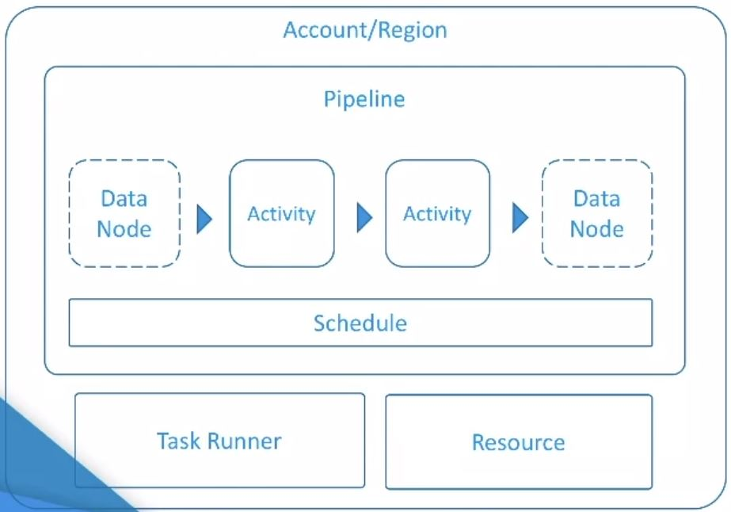
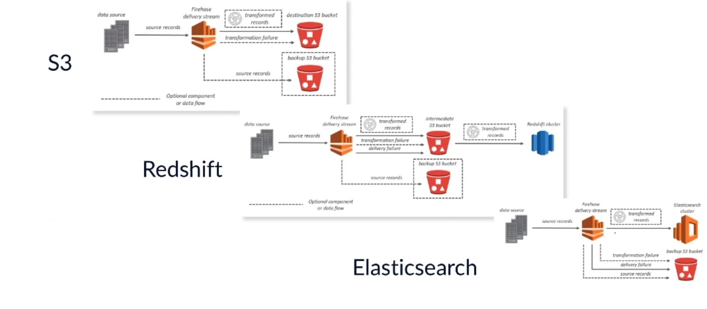

# AWS Big Data

---

## TOC

<!-- TOC depthFrom:2 depthTo:2 withLinks:1 updateOnSave:1 orderedList:0 -->

- [Intro to the Big Data Learning Path](#intro-to-the-big-data-learning-path)
- [Analytics Fundamentals](#analytics-fundamentals)
- [Database Fundamentals](#database-fundamentals)
- [Big Data Collection](#big-data-collection)
- [Big Data Storage](#big-data-storage)
- [Working with Dynamo DB](#working-with-dynamo-db)
- [Big Data Processing](#big-data-processing)
- [Intro to Machine Learning Principles and Practices](#intro-to-machine-learning-principles-and-practices)
- [Athena](#athena)
- [Intro to Amazon Kenesis](#intro-to-amazon-kenesis)
- [Working with Kenesis Analytics](#working-with-kenesis-analytics)
- [Big Data Visualization](#big-data-visualization)
- [Big Data Encryption](#big-data-encryption)

<!-- /TOC -->

---

<br/>

## Intro to the Big Data Learning Path

---

<br/><br/>

## Analytics Fundamentals

<br/>

### Analytics Concepts

**Data Analytics** - the science of data transformation, transforming data or raw data into meaningful information and
insights.

**Big data problems** must fall into one of the **three V's**
- *Volume*
  - GBs to ZBs
- *Velocity*
  - Real-time, batch, constant growth
- *Variety*
  - SQL data, CSV files, text, logs and semi-structured data

**Analytics Evolution**

Batch      ->       Real-time      ->     Prediction
  (BI Reporting)      (Alerting)              (Forecasting)

#### The Big Data Analytics Problem Approach


**Collect**
  - Services: Kinesis, Direct Connect, Import/Export, Snowball, SQS
  - Data collection or ingestion
  - Ingestion is the act of collecting and storing data
  - Types of date ingestion:
    - Transactional: DB Reads and Writes
    - Files: Logs, CSV, text
    - Streams: click-stream logs (set of events)
**Store**
  - Services: S3, RDS, Glacier, Dynamo DB
  - Storage engines integrated with Analytics tools to load/store data
  - Data Lake: decoupled store for Analytics
**Process/Analyze**
  - Services: EMR, Machine Learning, Data Pipeline, Elastic Search, Lambda, EC2, Redshift, Kinesis
  - The right tool depends on your problem and the type of data you have.
**Answers**
  - Services: QuickSight, Elastic Search (Kibana), or 3rd party software

<br/>

### Kenesis Family

- Amazon Kinesis is a fully managed service for real-time processing of **streaming data** at massive scale.
  - A stream is a constant data flow, generated in real-time, with sources such as website clickstreams, marketing and
    financial information, manufacturing instrumentation, social media, operational logs, metering data, etc.

Composed of **three streaming services**
1. Amazon Kinesis Streams
2. Amazon Kinesis Firehose
3. Amazon Kinesis Analytics

#### Amazon Kinesis Streams

Used for massive scale real-time data streaming and enables you to build custom applications to process or analyze
streaming data.

- You can have an unlimited number of sources writing data to a stream.
  - Each *source* is called a *producer*.
- To consume Kinesis, we take benefit of the KCL, the Kinesis Client Library.
  - With KCL we can build Amazon Kinesis applications and use streaming data to power real-time dashboards, generate
    alerts, implement dynamic pricing and advertising, and a lot more.

**General Features**

  - Real-time
  - Consume Kinesis by libraries (KPL and KCL)
    - KPL - Kinesis Producer Library
      - Puts items on the stream
    - KCL - Kinesis Client Library
      - Gets items from the stream
  - Parallel processing the same stream by different applications
  - Elasticity by dynamically adjusting the throughput of your stream
  - No upfront costs, pay as you go
  - Synchronously replicates your streaming data across three facilities in an AWS Region

**Important Concepts**

**Shard**
- A **shard** is the base throughput unit of an Amazon kinesis stream. **One shard provides a capacity of 1MB/sec data
  input and 2MB/sec data output**. One shard can support up to **1,000 PUT records** per second.
- You can dynamically add or remove shards form your stream as your data throughput changes via **resharding**.
  - **Splitting** - adding shards.
  - **Merging** - removing shards.

**Data Record**
- A record is the unit of data stored in an Amazon Kinesis stream. **A record is composed of a sequence number, partition
  key, and data blob.** A data blob is the content that your data producer adds to the stream. The **Maximum size** of a
  data blob (the data payload after Base64-decoding) **is 1 MB**.
- Each data record is stored **by default for 24 hours** and this can be set **up to 168 hours (7 days)**.

**Partition Key**
- Partition key is used to segregate and route data records to different shards of a stream.
- A partition key is specified by your data provider while putting data into an Amazon Kinesis stream.

**Sequence Number**
- Unique identifier for each data record.
- Assigned automatically by Amazon Kinesis Streams when a data producer calls the `PutRecord` (or `PutRecords`) API to add
  data to an Amazon Kinesis stream.
- Sequence numbers for the same partition key generally increase over time; the longer the time period between `PutRecord`
  (or `PutRecords`) requests, the larger the sequence numbers become.

**Kinesis Process**

**Common Kinesis stream's use-case**


First we **create streams** to handle the right amount of data.
  - Streams can be created in the Amazon Kinesis management console or by `CreateStream` API call.

Then we **develop** the **producer** to *continuously put data into streams*.
  - Cannot be done in the management console.
  - You need to *code an agent or a producer to insert the data into your stream*.
  - Producers can be a variety of sources, from mobile devices to servers and desktops.
  - The producers put data into our stream using the API calls `PutRecord` for a single record, or a `PutRecords` for a
    batch insert.
  - The *data records* are then *inserted* into the *shards* according to the producer defined partition key.

The EC2 instances are running the **consumers developed using the KCL library** that *read, process and send the data* to
its destination.
- for example, to rest on S3 or DynamoDB to be further analyzed on Redshift and EMR for example.

**DEMO: Create Stream**

#### Amazon Kinesis Firehose

- Focuses on the delivery of streaming data directly to a storage destination, such as S3 and Redshift
- Consumers are not needed to get data from the stream.  
- Only need to create Streams and develop Producers.

**Features and Benefits**

- Easy setup and configuration
  - Create a stream to feed S3 or Redshift in a few clicks.
- Load new data in near real-time
- Automatic scaling without intervention
- Multiple data destinations
- Integrated with CloudWatch metrics
- Automatic encryption optional

**Important Concepts**

- **Delivery Stream**
  - The main entity of Firehose
  - Does not require provisioning shards or partition keys
- **Records**
  - The data producer sends blob data as large as 1 MB to a delivery stream.
  - The blob data is called a record.
- **Data Producers**
  - Send records to a Delivery Stream

**Firehose Delivery Stream Demo**

#### Amazon Kinesis Analytics

- Allows you to run SQL queries on your streams
    - Search on real-time streaming data
- Connect to data streams from Kinesis Analytics
- Run standard SQL queries against data streams
- Kinesis Analytics can send processed data to analytics tools so you can create alerts and respond in real-time.

**Main Features**

- **Apply SQL directly to streams**
  - Easily connect to streams and apply you existing SQL skills
- **Real-time applications**
  - Perform continual processing on streaming big data with sub-second processing latencies.
- **Scaling and elasticity**
  - Elastically scales to match data throughput without and operator intervention

<br/>

### Elastic Map Reduce (EMR)

- An Amazon managed service to process vast amounts of data quickly and cost effectively.
- Based on the Apache Hadoop framework.
- Removes all the infrastructure management of a Hadoop cluster.
- Simplifies big data processing, providing a managed Hadoop framework to distribute and process vast amounts of data
  across dynamically scalable EC2 instances.
- Also supports:
    - Spark
    - Presto
      - open source distributed SQL query engine
      - optimized for low latency, ad-hoc analysis of data

**Use cases:**
  - log analysis
  - web indexing
  - data warehousing
  - machine learning
  - financial analyzing
  - scientific simulation
  - bioinformatics

**Features and Benefits**
  - Easy to use
  - low cost
  - Elastic
  - Reliable
  - Secure
  - Flexible

#### Elastic

- Elasticity is the characteristic to grow and shrink resources on demand.
- Easily and quickly provide the necessary capacity by adding or removing capacity at any time.
- **Core nodes** hold persistent data in HDFS and cannot be removed.  They must be reserved for the capacity required
until the cluster process completes.
- **Task nodes** are used for processing and can be added or removed, since they do not hold HDFS, they are ideal for
capacity only needed temporarily.
- There are two main options for scaling capacity.
  - Deploy/terminate multiple clusters
  - Resizing a running cluster

#### Low Cost

- Low hourly pricing
- EC2 spot integration
- EC2 Reserved Instance integration
- Elasticity
- S3 integration

#### Flexible Data Stores

Storage Backends:
- S3
    - most common
- HDFS
    - in the cluster itself - HDFS
- Dynamo DB
- Redshift
    - for integration with BI tools
- Glacier
- RDS

#### Getting Stared with EMR

- Upload
  - Upload data and processing application to S3
- Create
  - Configure and create you cluster by specifying data inputs, outputs, cluster size, security settings, etc.
- Monitor
  - Monitor the health and progress of your cluster.
  - Retrieve the output in S3.

#### Demo: Building an EMR Cluster

<br/>

### Amazon Machine Learning

Amazon ML allows you to build and train predictive applications hosted in a scalable cloud solution.

#### Machine Learning Concepts

- Machine learning can help you use historical data to make better business decisions.
- ML algorithms discover patterns in data. and construct mathematical models using these discoveries.
- With the models you can make predictions - predictive analytics.
- You can only use Amazon ML to apply machine learning to problems for which you have existing examples of actual answers.
- You can use **supervised** ML approaches for these specific machine learning tasks.
  - Binary classification (predicting one of two possible outcomes)
  - Multiclass classification (predicting one of more than two outcomes)
  - Regression (predicting a numeric value)

#### When to use Machine Learning

- You have a defined problem
- historical data
- The problem CANNOT be coded OR CANNOT scale
  - If the problem can be coded with deterministic rules then ML is not needed

#### Steps to get a highly effective ML application

1. Define the problem, the questions and expected answers
2. Collect, clean and prepare the data for the ML model
3. Build a predictive model with highly representative raw data to increase the training and predictive model power
4. Feed the prepared data to the ML platform
5. Generate predictions

<br/>

### Data Pipeline

AWS service that provides data-driven **big data workflow automation**.

- Allows simplified scheduling, management and orchestration of data-driven workflows.
- Automates big data workflows reducing complexity and tedious tasks for the data scientist.

**Example**

You have a website that has been configured to ship web logs to S3. So you could define a job that runs every hour to
get these logs from S3, processes them on an EMR cluster, and load the EMR results back to a SQL database.

The AWS Data Pipeline in this case would be responsible for the schedule, launching the EMR cluster, running the needed
resources to save the content back on a relational database, and return immediate report to you.


<br/>

### ElasticSearch Service

[AWS Elasticsearch Documentation](https://docs.aws.amazon.com/elasticsearch-service/latest/developerguide/what-is-amazon-elasticsearch-service.html)

- Amazon ES is a managed service that makes it easy to deploy, operate and scale Elasticsearch in AWS.
- Elasticsearch is a popular open-source search and analytics engine for use cases such as log analytics, real-time
  applications monitoring, click-stream analytics and text search.
- AWS has automated the cluster configuration and infrastructure tasks (similar to EMR).

#### Elasticsearch

- Elasticsearch is an analytics framework, usually combined with Logstash (data ingestion) and Kibana (analytics
  visualization)
- Use cases:
  - Full-text search
  - Intrusion detection
  - Batch data analytics problems
- Elasticsearch works as clusters of services for distributed analysis

Why AWS launched this service:
- Elasticsearch clusters are complex to create, operate and expand.
- Data Scientists want to focus on getting that data processed, not managing cluster issues.
- Simplifies use drastically.

Amazon ES integrates with other AWS services like IAM, CloudWatch and CloudTrail.

Allow cluster scaling by adding new nodes and storage resources on the fly.

#### Main Features

- Easy cluster configuration and management
- Supports the ELK stack
  - Elasticsearch, Logstash, Kibana
- Integrated with other AWS services:
  - IAM for security
  - CloudWatch for monitoring
  - CloudTrail for auditing
    - Records API calls
  - Also S3, Kinesis and Dynamo DB

#### Demo

<br/>

### QuickSight

A cloud based business Intelligence platform, currently only available for preview.

Amazon Quicksight is a very fast, cloud-powered bussiness intelligence (BI) service that makes it easy to build
visualizations, perfrm ad-hoc analysis, and quickly get business insights from you data.

Amazon Quicksight uses a new, *Super-fast, Parallel, In-memory, Calculation Engine* (SPICE) to perform advances
calculations and render visualizations rapidly.

- Easy exploration of AWS data
- Fast insights with SPICE
- Intuitive visualizations and transitions (AutoGraph)
- Native mobile support
- Secure sharing and collaboration (StoryBoard)

Supported sources:
  - EMR
  - RDS
  - Dynamo DB
  - Kinesis
  - S3 Redshift
  - File upload
  - 3rd-party

- Get answers fast by
  - Pointing QuickSight to a data source
  - APICE engine will generate answers from large data sets and return responses
  - Show your answers on QuickSight UI or 3rd party tools

---

<br/><br/>

## Database Fundamentals

<br/>

### Intro

- What is a Cloud Database?
- Overview of the AWS Database Services
- AWS Non Relational Databases
  - Amazon DynamoDB
  - Amazon Elasticache
  - Amazon Neptune
- AWS Relational Database Service
  - The RDS Service
  - MySQL for RDS
  - Microsoft SQL Server for RDS
  - Oracle for RDS
  - MariaDB for RDS
  - PostGresSQL for RDS
  - Amazon Aurora for RDS

<br/>

### Cloud Databases

Cloud databases generally using the same database software as a an on-prem database. The difference is that a managed
version of that database software is rented, providing everything needed.

AWS manages the underlying infrastructure and networking for that database service, the setup, configuration, and scaling
of the compute layer.


- The Amazon RDS service scales up or down to meet demand
- We can scale the service vertically or horizontally without needing to provision more server hardware
- We can enable multi-availability zone support easily and without up front investment

#### AWS Regions

- Each region is designed to be isolated from the others to achieve the greatest possible fault tolerance and stability .
- You only see the resources tied to the region you have specified.
- Billing is not tied to a specific region

#### Availability Zones

- Each region includes distinct facilities located in different areas within the region called **Availability Zones
  (AZ's)**.
- AZ's are distinct geographical locations that are engineered to be insulated from failures in any other AZ.
- Located on separate electrical grids, flood plains, risk profiles.
- By having Amazon RDS instances in more than on AZ a database can be protected from failure at a single location.

#### Connection

- Connecting to cloud databases is very similar to how we connect to corporate databases.
- ODBC connection string which is accessible by a machine running within our AWS account.
- The AWS database can also be accessed via the public internet.

#### Security

*AWS Shared Responsibility Model*


AWS is responsible for the physical environment and the bare-metal services are secure and users are responsible for
maintaining the security of the services that we run within the AWS environment.

Some user security responsibility includes:
- Roles and permissions for accessing those services.
- AWS provides encryption for data in transit within AWS infrastructure
    - In this case, in and out of the database services AWS provides.
- Data at rest can be encrypted
  - Information that's stored within a database

<br/>

### AWS Database Services Overview

AWS offers Relational Databases and Non-Relational Databases.


#### Relational Databases

- Structured tables
- Supports SQL
- **Schemas** defines tables
- Tables are *related* to reduce data redundancy
- Large Software footprint

The processing is done by the RDDMS script engine, which means a relational database is generally quite complex and
requires a lot of computing resources.

Relationship joins and key constraints on tables enables the "view" to select all the values we need from a group of
related tables.

Features like *views* and *store procedures* allow the creation of views on tables which can help speed things up. These
are processed by the database's native script engine to select the values from a number of tables using an early bound
process--the fastest way to return rows.

Relationships between tables, can be both temporary or permanent, make creating, selecting, or updating records from
multiple tables much easier.

Amazon RDS provides a managed service which handles the provisioning of the hardware, networking, and database
software. Amazon RDS enables a database to run in multiple availability zones, so its service is highly available, and  
manages database back up.

**RDS Services:**
  - MySQL
  - PostgresSQL
  - MSSQL (Microsoft SQL Server)
  - Oracle
  - MariaDB
  - Amazon Aurora
    - Amazon's own fork of MySQL which provides significantly faster processing and availability as it has its own
      cloud native database engine.

**Amazon RedShift** is Amazon's **data warehouse** solution.

#### Non-Relational Databases

- **No** table **schema** required
- Can support non-structured data
- Focus on providing a fast, secure data store
- Generally lack a processing engine so are lighter in design
- Small Software footprint
- Can scale better than relational databases

**NOSQL** - Not Only SQL

In a relational database we have a persistent connection to the database in which we can use SQL to interact with it.

With a non-relational database, we generally use a *RESTful HTTP interface*. Before your application can access a
database, it must be authenticated to ensure that the application is allowed to use that database and that it needs
to be authorized so that the application can only perform actions for which it has permissions.
- The syntax to retrieve data is different.


Without having to define the schema means changes to a non-relational database can be made faster. Non-relational
are **designed to handle non-structured data types** (videos, images, or data objects) that are not
uniform in structure.

Non-relational databases tend to be **more flexible and scalable** and generally require *less computing resources* by
providing *just* the *data store*--keeping any *code decoupled* from the storage layer.

**Relational databases are better suited for complex joins** with their native processing engine.

**Non-Relational Databases**
- DynamoDB
  - A cloud native object and document store
- Amazon Elasticache
  - A cache service running either the Redis or Memcahed cache engines.

#### Difference and Use Cases

**Relational**
  - Stores data and provides a processing engine
    - Processing engine within the database to manage processing of `SELECT`, `CREATE`, `REPLACE`, `UPDATE` and `DELETE`
      statements.
    - RDBMS / ACID engine
  - Uses SQL
  - Supports complex relationships between tables
  - Generally accessed via a persistent network connection (ODBC)
  - Uses schemas to define tables

**Non-Relational**
  - Just stores the data
  -  Simple document of key store.
  - Can store many different data types.
  - Generally accesses via RESTful HTTP
  - No Schema required
  - Every table mush have primary key
  - Scales fast
  - Lighter in design

<br/>

### Non-Relational Databases

#### DynamoDB

- A cloud native database for managing high volumes of records and transactions without the need to provisioning
capacity upfront.
- A fully managed service.
- Simple and scalable
- Fast
  - Speed has made it the go to database for online services that deal with high volumes of internet-based transactions.
- Supports both document and key store object types
  - Supports multiple data types at the same time, without the need to define a new schema or field type.
  - That makes it a good choice if you need a database that can keep growing to meet demand with many different types of objects stored in it.
- Runs as a web service, which we provision from the AWS console, or via API.
  - AWS also provides a downloadable version of DynamoDB that you can run locally on your computer or server.

#### Elasticache

- A managed data cache service built from the open source Redis and Memcached database engines.
- Provides a front line cache to respond to read requests made to an application or database.
- Built for speed not persistence.

**Cache**
  - The purpose of a cache is generally to act as a fast access copy of data that is being "read" a lot.
  - This reduces load on other part of a service or application.
  - The data is read form the cache instead of the permanent data store.
  - Holds data for a finite period of time.
  - If a record is changed it will update that record in the cache.

**Redis vs Memcached**

**Redis**

*Features*

Use Redis if you need:
  - Complex data types, such as strings, hashes, lists, sets, sorted sets or bitmaps.
  - Persistence of your key store.
  - To encrypt your cache data (to maintain compliance)
  - To replicate your cached data.

**Memcached**

*Simplicity and Speed*

Use Memcached if you need:
  - The simplest model possible
  - To run large nodes with multiple cores or threads.
  - The ability to scale out/in, adding and removing nodes as demand on your system increases and decreases.


#### Amazon Neptune

Native graph database engine optimized for storing data relationships and querying a graph quickly and efficiently.

Use cases:
  - knowledge graphs
  - recommendation engines
  - network security

Supported graph models:
  - Property Graph
  - W3C RDF

Supported languages:
  - Apache
  - TinkerPop
  - Gremlin
  - SPARQL

<br/>

### AWS Relational Databases RDS

Amazon RDS is Amazon's managed relational database service. RDS is the core platform for running relational databases
on AWS.

The benefit of using the relational database service is that as a managed service, the *infrastructure management*
and *backup* routines are all *automatic*.

*Note:* We don't have to use Amazon RDS to run a relational database service. We could run our own version of a
relational database service on an EC2 instance for example.

### Benefits

- Ability to scale components
- Automatic backups and patching
- High Availability
- Automatic failure detection and recovery

#### Services

**MySQL**

**Version Support**
  - Amazon RDS for MySQL currently supports MySQL Community Edition versions 5.5, 5.6 and 5.7

**Instance Support**

MySQL database instances are pre-configured with parameters and settings for the server type that you've selected.

  - *Micro instances* - often associated with free tier, so useful for non-production or pilot projects.
  - *General purpose* - Latest and current generation like the M series.
  - *Memory Optimized* - Latest and current generation R series instances.
  - *Burst support* - Latest and current T series instances.

**Storage Support**
  - Both SSD backed.

- *General Purpose* storage provides cost-effective storage for small or medium-sized workloads.
- *Provisioned IOPS* will deliver consistent performance of up to 40,000 IOPs per second.


**Other Features**
  - *multi-AZ feature* of MySQL and RDS allows the creation of read replicas of your database deployed across more than
    one availability zone.
  - *Auto-scaling*
  - *point-in-time restore and snapshot restore*
    - choose the InnoDB storage engine when you provision your MySQL instance.

<br/>

**Microsoft SQL Server**

**Version Support**
  - RDS enables you to run multiple editions of SQ Server (2008 R2, 2012, 2014, 2016 and 2017) including Express, Web,
    Standard and Enterprise.

**Instance Support**
  - *General Purpose* - Latest and current generation like the M series.
  - *Memory Optimized* - Latest and current generation R series instances.
  - *Burst support* - Latest and current T series instances.

**Storage Support**
  - *General Purpose SSD* - Delivers a consistent baseline of 3 IOPS per GB with the ability to burst up to 3,000 IOPS.
  - *Provisioned IOPS SSD* - With storage from 100 GB to 16 TB, you can provision from 1,000 to 32,000 IOPS for new SQL
    Server DB Instances.

**Other Features**
  - *multi-AZ feature*
  - *Auto-scaling*
  - *point-in-time restore and snapshot restore*
    - Transaction log is backed up at five-minute intervals enabling point-in-time recovery to any given second.
    - Automatic backups can be stored for up to 35 days.
    - Manual snapshots of the whole Microsoft SQL Server database will be stored indefinitely.

**Current Limitations**

For large Enterprise SQL Server clusters, the always-on feature, which is part of 2012 Enterprise edition, replication
and database log shipping are not currently supported in Microsoft SQL Server on Amazon RDS.

<br/>

**Oracle**

**Version Support**
  - *BYOL*: Standard Edition Two (SE2), Standard Edition One (SE1), Standard Edition (SE) and Enterprise Edition (EE).
    - the licenses that you can use for these are the Standard Edition One and Standard Edition Two.
  - *Oracle Database 12c*, (includes but limited to) Oracle Fusion Middleware and Oracle Enterprise Manager.

You can use your own license or rent these services by hour with license included. This means you can select and run
multiple versions of these powerful tools, without the need to pre-purchase license or significantly-sized hardware.

**Benefits** of running Oracle databases on AWS infrastructure:
  - speed
  - flexibility
  - cost
    - CapEx Reduction
    - With a BYO License or the built-in Oracle license where you use it for pay-per-use, this reduces the often
      significant cost of provisioning an Oracle database machine.

**Other Features**
  - *automatically patches* the database
  - *database back up*
      - Set how long you want the backups to be kept, which provides flexibility for point-in-time recovery planning.
  - provision compute instances in the AWS console


**Oracle on RDS also Supports**
  - SAP Business Suite and Oracle
  - JD Edwards EnterpriseOne
  - Amazon Redshift as a data-source for Oracle Business Intelligence (OBIEE) versions 12.2.1.0 and 12.2.1.1

One *limitation* to keep in mind with Oracle RDS is that as it is provided as a managed service, you won't have all
access to the underlying hardware or operating system that you might be accustomed to. This is only a consideration if
you're currently writing logs to local directories or you have code that is dependent on access to the OS.

<br/>

**MariaDB**

A community develop fork of the MySQL relational database management system.

**Version Support**
  - Amazon RDS for MariaDB supports version 10.1 to 10.2.11

**Instance Support**
  - *Micro instances* - often associated with free tier, so useful for non-production or pilot projects.
  - *General purpose* - Latest and current generation like the M series.
  - *Memory Optimized* - Latest and current generation R series instances.
  - *Burst support* - Latest and current T series instances.

**Storage Support**
  - InnoDB is the default storage engine for Version 10.1 and above.
  - You can create read replicas for MariaDB.

**Other Features**
  - multi-AZ deployments,
  - automated backups, failover, and recovery.

**PostGresSQL**

An open-source relational database service, that sits between the cost and scalability of a not only SQL database,
and the power of the current family of relational database services available.

**Provides**
  - Multi-AZ support
  - Read replicas
  - Automatic backups
  - integrated with the AWS Database Migration Service
  - Well suited for meeting HIPPA / PHI / FedRAMP compliance

**Version Support**
  - Supports PostGresSQL 9.3, 9.4, 9.5 and 9.6

**Instance SUpport**
  - Micro Instances
  - Standard - Latest + Previous Generations
  - Memory Optimized - Current Generation

**Storage Support**
  - General Purpose (SSD) - delivers a consistent baseline of 4 IOPS per provisioned GB and provides the ability to burst
    up to 3,000 IOPS
  - Provisioned IOPS (SSD) - up to 16 TB storage and 40,000 IOPS per database instance.

<br/>

**Amazon Aurora**

Amazon's own fork of MySQL which provides significantly faster processing availability than a native MySQL and Postgres
compatible relational database service.

- *Cloud native* - Amazon Aurora was designed and built from the ground up to be *cloud native*.
- *High-performance database service*
  - speed and availability benefits


**Features**
  - Replicates data across three availability zones by default.
  - Upon creation of an Amazon Aurora instance, the Aurora service also deploys a cloud native database cluster,
    which the Aurora instances will use as the underlying data store.
  - The database cluster spans two or more availability zones by default, with each availability zone having a copy of
    the database cluster data.
  - Each cluster has one primary instance which performs all of the data modifications to the cluster volume and
    supports read and write operations.
  - Each cluster also has at least one Aurora replica which supports only read operations.
  - Each Aurora DB cluster can have up to 15 Aurora replicas of the primary instance.
  - The multiple Aurora replicas distribute the read workload. By locating Aurora replicas in separate availability
    zones, you can increase your database availability while increasing read replica performance.

This makes the response and recovery time for Amazon Aurora significantly faster and durable on most RDS services.

<br/>

### DEMO: Setting up the AWS Relational Database Service

<br/>

### Deciding which Database to use

- **RDS Services:**
  - MySQL
  - PostgresSQL
  - MSSQL
  - Oracle
  - MariaDB
  - Amazon Aurora

- **Non-Relational Databases**
  - DynamoDB
  - Amazon Elasticache
    - Redis or Memcahed engine

#### Scenario - Claims Management System

**We want to build a web based claims management system for our insurance firm**
  - The claims management system will be a prototype
  - The successful in testing with claims processing staff and brokers we pan to iterate on the design toward a
    production version.

**We need a database to collect and store the claims and customer data from the web based service.**
  - Most of the data we will be storing will be in text fields below 255 characters
  - However, insurance policies tend to be quite complex so it is likely that we will need to support joins and queries
    required to render work with records.
  - The data needs to be backed up and available at all times.
  - The number of records expected to be below 5 million.
  - The front end application will be developed in Javascript.
  - We've been told by our IT administrator staff that we should use Microsoft SQL Server.  

You must always challenge design assumptions to ensure that the services best meets requirements.

For our scenario, we need a database to store information collected from web forms submitted by customers or from data
entered by our claims processing staff. The data relationships will not be the priority for working in the forms.
However, we will want to create views to help staff search for users and customers and to update information from a
web form. So some type of relationship between tables will be useful, and it's likely to reduce the amount of
development time required to build or modify the front-end application forms.

**RDS - When to use?**
  - Enables us to implement and start using Microsoft SQL Server with no up front costs from within the console.
  - Highly available
  - Only pay for time used.

**DynamoDB - When to use?**
  - Provides reliable performance
  - Auto scaling of throughput capacity
    - Great for burst capacity

We will need to create relationships between tables to present data back to the application and so to our end users.
Now are those relationships so much of a constraint to mean it could become an overhead to manage those relationships
within our application layer?

Do we want to handle that type of table join and structured query relationship in the database or at the application
code layer?

Do we need the full processing power of a relational database or is the priority to have flexibility and scalability?

And where does cost sit in this equation?

**Design Considerations**
  - Data types could change
  - Finite development resource is available to us
  - Encryption at rest is a requirement
  - Relationships between tables will be useful and save time
  - There may be significant burst load on the service at times
  - What is the priority?
    - Relationship / processing engine?
    - Flexibility?
    - Scalability?
    - Cost?

Sometime requirements change...

Burst load increases during storms and images are needing stored for the claims process.  

We can save the images in S3 vs a BLOB field in the database which will reduce the load on the database.

With cloud databases, when we learn more about the usage patterns we can adjust our design to suit.


To handle the relation requirements and the burst capacity it makes sense for us to use an RDS service with
Elasticache to reduce the number of read requests to our database. Read requests that are made over and over will be
stored temporarily within the ElastiCache database which will respond and send that frequently requested data to the
web application front end.

There is no need to purchase, provision or set up hardware to scale the service.


<br/>

### Summary


---

<br/><br/>

## Big Data Collection


**Areas Covered:**
  - Processing and Storage patterns
  - Architecture
  - Core Concepts
  - Service Limits

**Lessons**:
  - *Data Pipeline*
    - Introduction to Data Pipeline
    - AWS Data Pipeline Architecture
    - AWS Data Pipeline Core Concepts
    - AWS Data Pipeline Reference Architecture
  - *Amazon Kinesis*
    - Introduction to AWS Kinesis
    - Kinesis Streams Architecture
    - Kinesis Streams Core Concepts
    - Kinesis Streams Firehose Architecture
    - Firehose Core Concepts
    - Kinesis Wrap-Up
  - *Amazon Snowball*
    - Introduction to Snowball
    - Snowball Architecture
    - Snowball Core Concepts
    - Snowball Wrap-Up

<br/>

### Data Pipeline

<br/>

#### Introduction to Data Pipeline

AWS Data Pipeline is primarily designed to collect data from a data source and move it to a target data source but
it also allows you to process data as you move it.

So it is often used as the core service within a big data analytics solution or as a modern ETL capability.

AWS Data Pipeline helps you create complex data workloads that are fault tolerant, repeatable, and highly available.
By executing the scheduling retry and failure logic for these weak flows is a highly-scalable and fully-managed service.

**Processing Patterns**

1. Real-time streaming: seconds, or less, to get answers back
2. Transaction: seconds to minutes to get answers back
3. Queue: seconds to minutes to get answers back
4. *Batch Execution*: minutes to hours to get answer back


When choosing a big data processing solution the required **latency** will be the primary decision driver.

**AWS Data Pipeline** is dependent on the way your pipeline is defined for its processing pattern but the closest
is **batch execution**--the typical ETL work flow paradigm.

**Storage Patterns**

1. Structured: relational data (schema on write)
2. Semi Structured: log files (schema on read)
3. Unstructured: media (binary, no schema)

AWS Data Pipeline needs a defined target, big data solution that will store the results of the pipeline process.

AWS Data Pipeline is a web service that helps you reliably process and move data between different AWS compute and
storage services, as well as on-premise data sources, at specified intervals. AWS Data Pipeline also allows you to
move and process data that was previously locked up in on-premise data silos.

**Ideal Usage Patterns**
  - ETL
  - Run EMR Jobs
  - Custom Applications
  - Data Transfers

With AWS Data Pipeline, you can regularly access your data, transform and process it at scale, and efficiently
transfer the results to AWS services such as Amazon S3, Amazon RDS, Amazon DynamoDB, and Amazon EMR.

AWS Data Pipeline helps create complex data processing workloads that are fault tolerant, repeatable, and highly
available.

You don't have to worry about insuring resource availability, managing inter-task dependencies, retrying transient
failures, or time-outs and individual tasks, or creating a failure-notification system.

<br/>

#### AWS Data Pipeline Architecture



- **Data Nodes**
  - The location of input data for a task or the location where output data is to be stored.
- **Activities**
  - A definition of work to perform, on a scheduled basis, using a computational resource and typically consuming
    data from input data nodes and storing the results on output data nodes--Chaining these objects together to
    create a workflow process.
- **Pipeline**
  - Workflow processes.
  - The pipeline definition specifies the end-to-end business logic of your data management processes.
- **Schedule**
  -  Define the timing of a scheduled event, such as when an activity runs.
- **Preconditions**
  - A component of your pipeline definition which contain conditional statements that must be true before an activity
    can run.
  - For example, whether source data is present before a pipeline activity attempts to copy it.
- **Task Runner**
  - Polls for tasks and then performs those tasks.
  - For example, task runner could copy log files to Amazon S3 and launch Amazon EMR clusters.
  - Task runner is installed and runs automatically on resources created by your pipeline definitions or on your own
    dedicated compute server.
  - You can write a custom task runner application or you can use the task runner application that is provided by the
    AWS Data Pipeline service.
  - Task runners use the resources you have defined to execute the activities.
- **Resources**
  - The computational resource that performs the work that a pipeline activity specifies.
  - AWS Data Pipeline supports the use of EC2s and EMR clusters.

**Architect Screen - Pipeline Workflow Visualization**


<br/>

#### AWS Data Pipeline Core Concepts

**Data Pipeline Definition**
  - Names, locations and formats of your **data sources**
  - **Activities** that transform the data
  - The **schedule** for those activities
  - **Resources** that run your activities and **preconditions**
  - **Preconditions** that must be satisfied before the activities can be scheduled
  - Ways to alert you with **Status updates** as pipeline executions proceeds

From your pipeline definition, AWS Data Pipeline determines the tasks that will occur, schedules them and assigns
them to task runs. If a **task** is **not successful**, AWS Data Pipeline **retries** the **task** according to your
instructions. If necessary, reassigns it to another task runner. If the **task fails repeatedly**, you can configure the
pipeline to **notify** you.

<br/>

**Data Nodes**

A Data Node defines the location and type of data that a pipeline activity uses as an input or output.

You define the relevant parameters for connecting to each data source.

**Supported Data Nodes:**
  - *DynamoDB* - A DynamoDB table that contains data for HiveActivity or EmerActivity.
  - *SQL* (RDS & JDBC) - A SQL table and data base query that represents data for a pipeline activity.
  - *Redshift* - An Amazon Redshift table that contains data for RedshiftCopyActivity.
  - *S3* - An Amazon S3 location that contains one or more files for a pipeline activity.

<br/>

**Activities**

An **Activity** is a pipeline component that defines the work to perform.

**Preconfigured Activities:**
  - *CopyActivity* - Copies data from one location to another  
  - *EmrActivity* - Runs an EMR cluster
  - *HiveActivity* - Runs a Hive query on an EMR cluster
  - *HiveCopyActivity* - Runs a Hive query on an EMR cluster with support for advanced data filtering and support
    for S3DataNode and DynamoDBDataNode
  - *PigActivity* - Runs a Pig script on an EMR cluster
  - *ReshiftCoptActivity* - Copies data to and from Redshift tables
  - *ShellCommandActivity* - Runs a custom UNIX/Linux shell command as an activity
  - *SqlActivity* - Runs a SQL query on a database

Activities are extensible, so you can run your own custom scripts to support endless combinations.

<br/>

**Schedules**
  - On Activation or Scheduled
  - Multiple scheduled objects
  - Parameters
    - Frequency
    - Start date
    - End date
    - Number of occurrences
    - Parent / Dependencies

<br/>

**Task Runner**
  - A task agent application
  - Polls AWS Data Pipeline for tasks and executes them on EC2 instances, EMR clusters or other computational resources.
  - Install Options
    - Launched resources
    - Dedicated resources
  - Performs a task and reports its status back to AWS Pipeline
  - Customized task runners can be defined


**A task is a discreet unit of work** that the AWS Data Pipeline service shares with a Task Runner.

There are two ways you can use Task Runner to process your pipeline.
1. Enable AWS Data Pipeline to install Task Runner for you on resources that are launched and managed by the AWS Data
   Pipeline web service.
2. Install Task Runner on a computational resource that you manage, such as a long-running EC2 instance or an
   on-premise server.

<br/>

**Preconditions**

A precondition is a pipeline component containing conditional statements that must be true before an activity can run.
For example, a precondition can check whether source data is present before a pipeline activity attempts to copy it.

Preconditions are extensible and allow you to run your own custom scripts to support endless combinations.

**System-Managed Preconditions**
  - *DynamoDBDataExists* - Checks whether data exists in a specific DynamoDB table
  - *DynamoDBTableExists* - Checks whether a DynamoDB table exists
  - *S3KeyExists* - Checks whether an S3 key exists
  - *S3PrefixNotEmpty* - Checks whether an S3 prefix is empty

**User-Managed Preconditions**
  - *Exists* - Checks whether a data node exists
  - *ShellCommandPrecondition*- Runs a custom UNIX/Linux shell command as precondition.

*Note:* User-managed preconditions only run on the computational resource that you have specified.

<br/>

**Data pipeline Creation**

Data pipelines can be created, accessed and managed using any of the following interfaces:

- AWS Management Console
  -  a drag-and-drop web interface
- AWS Command Line Interface (AWS CLI)
- AWS SDKs
- Query API

**Data Pipeline Integration**

**Data Access and Storage:**
- DynamoDB
- RDS
- Redshift
- S3

**Transformation resources:**
- EC2
- EMR

**AWS Data Pipeline Account Limits**

The limits shown below apply to a single AWS account. If you require additional capacity, you can use the standard
Amazon process to increase the limits for your account where the limit is flagged as 'adjustable'.


**AWS Data Pipeline Web Service Limits**

AWS Data Pipeline limits the rate at which you can call the web service API.

These limits also apply to AWS Data Pipeline agents that call the web service API on your behalf, such as the Console,
the CLI and the Task Runner.

The limits apply to a single AWS account.

**Burst rate** - You save up web service calls during periods of inactivity and expend them all in a short amount of
time.
 - Ex. An agent has a regular rate of one call each one second. If you don't call the service for 30 seconds, you will
  have 30 calls saved up. This keeps your average calls at the regular rate limit.

Your calls are not throttled. If you exceed the rate limit or the burst limit, your web service call fails and it
returns a throttling exception.


AWS Data Pipeline scales to accommodate a huge number of concurrent tasks and you can configure it to automatically
create the resources necessary to handle large workloads.

These automatically created resources are under your control and count against your AWS account resource limits for
other services. For example, if you configure AWS Data Pipeline to automatically create a 20-node Amazon EMR cluster
to process data and your AWS account has an EC2 instance limit set to 20, you may inadvertently exhaust your
available backfill resources. As a result, consider these resource restrictions in your design or increase your
account's limits accordingly.

<br/>

#### AWS Data Pipeline Reference Architecture


 In this scenario, we have sensor data being streamed from devices, such as power meters or cell phones, using Amazon
 Simple Queuing Services (SQS) to a DynamoDB database. From there, AWS Data Pipeline is used to move the data from
 DynamoDB to EMR and trigger an EMR job to execute some polling processes on that data. From there, the data can be moved
 from EMR into Redshift to enable our standard business intelligence tools to use it for reporting purposes.

<br/>

### Amazon Kinesis

<br/>

#### Introduction to Amazon Kinesis

Used for massive scale real-time data streaming and enables you to build custom applications to process or analyze
streaming data.

Amazon Kinesis makes it easy to **collect, process, and analyze real-time streaming data** so you can get timely
insights and react quickly to new information.

With Amazon Kinesis, you can **ingest real-time data** such as application logs, website clickstreams, IoT to imagery
data, and more, **into your databases**, your data lakes and data warehouses.

**Processing Patterns**

1. *Real-time streaming*: seconds, or less, to get answers back
2. Transaction: seconds to minutes to get answers back
3. Queue: seconds to minutes to get answers back
4. Batch Execution: minutes to hours to get answer back

When choosing a big data processing solution the required **latency** will be the primary decision driver.

**AWS Kinesis** is primarily designed to deliver processing orientated around real-time streaming.

**Storage Patterns**

1. Structured: relational data (schema on write)
2. Semi Structured: log files (schema on read)
3. Unstructured: media (binary, no schema)

**AWS Kinesis does not store persistent data**, it needs a defined target, big data solution that will store the
results of the stream in process.


In case the delivery destination is unavailable, **Amazon Kinesis stores data temporarily**.
  - Amazon Kinesis Firehose delivery stream stores data for up to 24 hours
  - Kinesis stream stores data for 24 hours by default, but can be extended to seven days.

Amazon Kinesis can continuously capture and store terabytes of data per hour from hundreds or thousands of sources,
such as website clickstreams, financial transactions, social media feeds, IT logs, and location-tracking events.

**Ideal Usage Patterns**:
  - Real-time data analytics
  - Log and data feed intake and processing
  - Real-time metrics and reporting

**Three different solution capabilities**
  1. *Amazon Kinesis Streams*
    - Build custom applications that process or analyze streaming data
  2. *Amazon Kinesis Firehose*
    - Easily prepare and load real-time streaming data into Kinesis analytics, S3, RedShift and Elastic Search Services
  3. *Amazon Kinesis Analytics*
    - Easily process and analyze streaming data with SQL queries

<br/>

#### Kinesis Streams Architecture

Amazon Kinesis Streams is based on a platform as a service (PaaS) style architecture, where you determine the
throughput capacity you require and the architecture and components are automatically provisioned, installed, and
configured for you.


**Stream**
  - A stream is an ordered sequence of data records.
**Producer**
  - producers continuously push data to Kinesis Streams
**Records**
  - A record is the unit of data in an Amazon Kinesis Stream.
**Shard**
  - A **shard** is the base throughput unit of an Amazon kinesis stream.
**Consumers/Applications**
  - consumers process the data in realtime


<br/>

#### Kinesis Streams Core Concepts

**Streams**
  - The throughput capacity needed for a stream is specified upon its creation.
  - Streams can be created in the Amazon Kinesis management console or by `CreateStream` API call.
  - The total capacity of the stream is the sum of the capacity of its shards.

**Producer**
  - Producers are essentially data sources that continuously push data to Kinesis Streams
  - You can have an unlimited number of sources writing data to a stream.
  - Producers can be a variety of sources, from mobile devices to servers and desktops.
  - Development
      - KPL - Kinesis Producer Library
      - Cannot be developed in the management console.
      - You need to *code an agent or a producer to insert the data into your stream*.
  - The producers *put data into our stream* using the API calls `PutRecord` for a single record, or a `PutRecords` for a
    batch insert.
  - To put data into the stream, you must specify the name of the stream, a partition key, and the data blob to be
    added to the stream. The partition key is used to determine which shard in the stream the data record is added to.

*Partition Keys*
  - The *data records* are then *inserted* into the *shards* according to the *partition key*.
  - Used to segregate and route data records to different shards of a stream.
  - Specified by your data producer while putting data into an Amazon Kinesis stream.
  - Unicoded strings with a maximum length of 256 bytes. An MD5 hash function is used to map partition keys to a
    128-bit integer value and to map associated data records to shards.

*Sequence Number*
  - Unique identifier for each data record.
  - Assigned automatically by Amazon Kinesis Streams when a data producer calls the `PutRecord` (or `PutRecords`) API to
    add data to an Amazon Kinesis stream.
  - Sequence numbers for the same partition key generally increase over time; the longer the time period between
    `PutRecord` (or `PutRecords`) requests, the larger the sequence numbers become.

**Records**
  - A record is the unit of data in an Amazon Kinesis Stream.
  - **A record is composed of a sequence number, partition key, and data blob.**
  - A data blob is the data of interest your data producer adds to a stream.
  - The **Maximum size** of a data blob (the data payload after Base64-decoding) **is 1 MB**.
  - A partition key is used to segregate and route records to different shards of a stream.

*Data Retention*
  - Each data record is stored **by default for 24 hours** and this can be set **up to 168 hours (7 days)**.
  - It costs more to increase retention above, the default of, 24 hours.

**Shard**
  - A **shard** is the base throughput unit of an Amazon kinesis stream.
  - Each shard can handle 5 transactions per second.
  - **One shard provides a capacity of 1MB/sec data input and 2MB/sec data output**.
  - One shard can support up to **1,000 PUT records** per second.
  - You specify the number of shards needed when you create a stream.
  - The total capacity of the stream is the sum of the capacity of its shards.
      - If your data rate increases, you can increase or decrease the number of shards allocated to your stream.

*Pricing*
  - Shard Hour (1 MB/sec ingress, 2 MB/sec egress) - $0.015
  - PUT Payload Units, per 1,000,000 units - $0.014
  - Extended Data Retention (up to 7 days), per shard hour - $0.020

*Shard Calculation formula:*
`number of shards = max( incoming_write_bandwidth_in_KB / 1000, outgoing_read_bandwidth_in_KB / 2000 )`

*Resharding*
- You can dynamically add or remove shards form your stream as your data throughput changes via **resharding**.
  - **Splitting**
      - Divide a single shard into two shards
      - Cannot split into more than two shards in a single operation
  - **Merging**
    - Combine the two shards into a single shard
    - Cannot merge more than two shards in a single operation
- Parent shards    
  - The shard or pair of shards that the re-sharding operation acts on are referred to as parent shards.
- Child Shards
  - The shard or pair of shards that result from the re-sharding operation are referred to as child shards.
- After you call a re-sharding operation, you need to wait for the stream to reactivate.
- When you re-shard, data records that were flowing to the parent shards are rerouted to flow to the child shards
  based on the hash key values that the data record partition keys map to.
- Any data records that were in the parent shards before the re-shards remain in those shards.
    - Parent shards do not disappear when the re-shard occurs. They persist along with the data they contained prior
      to the re-shard.

**Consumers/Applications**
  - Gets records from the Kinesis Stream and processes the data in real-time
  - You need to create your own consumer applications.
  - Each consumer must have a unique name that is scoped to the AWS account and region used by the application.

*Application Monitoring*

The consumer name is used for the *control table in Amazon Dynamo DB* and the name space for *Amazon CloudWatch metrics*.

When your application starts up, it creates an Amazon Dynamo DB table to store the application state, connects to the
specified stream and then starts consuming data from the stream. The Kinesis Streams metrics using the CloudWatch
console.


*Application Development and Deployment*

With the *Kinesis Client Library*, KCL, we can develop Amazon Kinesis applications and use streaming data to power
real-time dashboards, generate alerts, implement dynamic pricing and advertising, and a lot more.

Consumers can be deployed to an EC2 instance. The EC2 instances are running the consumers, developed using the KCL,
that *read, process and send the data* to its destination. For example, to rest on S3 or DynamoDB to be further
analyzed on Redshift and EMR for example. The KCL can be used to simplify parallel processing of the stream by a
fleet of workers running on the EC2 instances. The KCL simplifies writing code to read from the shards in the stream
and it ensures that there is a worker allocated to every shard in the stream. The KCL also provides help with *fault
tolerance* by providing check pointing capabilities.

*Shard Iterator*

Each consumer reads from a particular shard using a shard iterator. A shard iterator represents the position in the
stream from which the consumer will read. When they start reading from a stream, consumers get a shard iterator
which can be used to change where the consumers read from the stream. When the consumer performs a read operation,
it receives a batch of data records based on the position specified by the shard iterator.

**Limits**


---

<br/>

#### Kinesis Streams Firehose Architecture

Amazon Kinesis Firehose is a fully-managed service for delivering real-time streaming data to destinations. Amazon
Kinesis Firehouse is based on a platform as a service, PaaS, style architecture. When you determine the throughput
capacity required the architecture and components are automatically provisioned.

With Kinesis Firehose, you do not need to write applications or manage resources--shards, etc. You configure your data
producers to send data to Kinesis Firehose and the data is automatically delivered to the destination that you specify.
You can also configure Amazon Kinesis Firehose to transform your data before delivery.


- Delivery Stream
  - the underlying entity of Kinesis Firehose.
  - A delivery stream is effectively defined by the target system that receives the streamed data.
  - Data records are stored for up to 24 hours in case the delivery destination is unavailable.
- Data Producer
  - Send records to Kinesis Firehose delivery streams
- Data Flows
  - The transfer and load process
- Destinations
  - **Currently supports: S3, Redshift and Elasticsearch.**
- AWS Lambda
  - Can be used to transform the data before loading into the destination.

*Example:* if you are loading into Amazon Redshift, the *data flow* defines the process of *landing* the data into an
S3 bucket and then invoking the copy command to load the Redshift table. Kinesis Firehose can also invoke an AWS
Lambda function to *transform* incoming data before delivering it to the selected destination.

<br/>

#### Firehose Core Concepts

**Data Flows**



Firehose is simple to use data flows are predefined based on the destination.

For Amazon **S3** destinations, streaming data is delivered to your S3 bucket. If data transformation is enabled, you
can optionally back up source data to another Amazon S3 bucket.

For Amazon **Redshift** destinations, streaming data is delivered to your S3 bucket first. Kinesis Firehose then
issues an Amazon Redshift copy command to load from your S3 bucket to your Amazon Redshift cluster.

If **data transformation** is enabled, you can optionally back up source data to another Amazon S3 bucket.

*Note:*
  - Amazon Redshift cluster must be publicly accessible and the Kinesis Firehose IP addresses must be unblocked.
  - Kinesis Firehose doesn't delete the data from your S3 bucket after loading it to your Amazon Redshift cluster.

For Amazon **Elasticsearch** destinations, streaming data is delivered to your Amazon Elasticsearch cluster and can
optionally be backed up to your S3 bucket concurrently.

**Limits**


<br/>

#### Kinesis Wrap-Up

**Amazon Kinesis Streams** is a service for workloads that require custom processing, per incoming record, with sub-second
processing latency, and a choice of stream processing frameworks.

**Amazon Kinesis Firehose** is a service for workloads that require zero administration, ability to use existing analytics
tools based on S3, Redshift and Elasticsearch, with latency of 60+ seconds.

We use Firehose by creating a delivery stream to a specified destination and send data to it. You do not have to create
a stream or provision shards, you do not have to create a custom application as the destination, and you do not have
to specify partition keys, unlike streams. However, Firehose is limited to S3, Redshift, and Elastic Search as the
data destinations.

<br/>

### Amazon Snowball

<br/>

#### Introduction to Snowball

Snowball is a petabyte-scale data transport solution that uses secure appliances to transfer large amounts of data
into and out of the AWS Cloud.

With Snowball, you don't need to write any code or purchase any hardware to transfer your data. Simply create a job
in the AWS Management Console and a Snowball Appliance will be automatically shipped to you. You then encrypt and
transfer the files to the appliance at high speed, then return the appliance to AWS and they will move your data to
S3 for you.

Snowball addresses common challenges with large-scale data transfers, including high networks costs, long transfer
times, and security concerns. Transferring data with Snowball is simple, fast, and secure, and can be as little as 1/5
the cost of high speed Internet.

Typically used when the it is faster and cheaper to load data onto physical machines and ship them to and from instead of
transferring data over the internet.

<br/>

#### Snowball Architecture

AWS Snowball is a service that accelerates transferring large amounts of data, usually greater than 10 TB, into and
out of AWS using physical storage appliances, bypassing the internet. Each AWS Snowball appliance type can transport
data at faster than internet speeds. This transport is done by shipping the data in the appliance through a regional
carrier. The appliances are rugged shipping containers complete with e-ink shipping labels. The appliances and provides
powerful interfaces that you can use to create jobs, transfer data, and track the status of your jobs through to
completion.


Appliance types:
- Snowball
- Snowball Edge

Each Snowball appliance is protected by AWS key management services to protect your data while the Snowball is in
transit.

Snowballs come in two sizes, 50 terabytes and 80 terabytes. Snowballs include a 10 gig Base-T network connection both
RJ45 as well as SFP plus with either a fiber or copper interface to minimize the transfer.

<br/>

#### Snowball Core Concepts

Connections
  - RJ45
  - SFP + Copper
  - SFP + Optical

Snowball Client
  - Software that you install on a local host computer, and use to efficiently identify, compress, encrypt, and
    transfer data to the Snowball appliance.

Transfer Workstation
  - The computer, server, or virtual machine that hosts your mounted data source.
  - You'll connect the Snowball to this workstation to transfer your data.
  - The workstation is considered the bottleneck for transferring data between the Snowball and the data source, it is
    highly recommended that your workstation is a powerful computer, able to meet high demands for processing, memory,
    and networking.
    - 16 core CPU
    - 16 GB RAM

<br/>

**AWS Snowball Edge**

AWS Snowball Edge is a hundred terabyte data transfer device with onboard storage and compute capabilities. You can
use Snowball Edge to move large amounts of data into and out of AWS as a temporary storage tier for large local data
sets, or to support local workloads in remote or offline locations.

Essentially, a temporary storage device used on-premise that you use until its filled when you then ship it to AWS to
load the data to S3.

- 73 TB usable per stand alone appliance

*Clusters*
  - Clusters have 5 to 10 AWS Snowball Edge appliances called nodes.
  - You will need to choose one node as the leader node, and the remaining as the secondary nodes.
  - 45 TB per Cluster Node.  

*Cluster Quorums*
  - A quorum is the minimum number of Snowball Edge devices in a cluster that must be communicating with each other
    to maintain operation.
  - Quorum Types: Read/write quorum and read quorum

*Example:* Let's say you've uploaded your data to a cluster of Snowball Edge devices. With all devices healthy, you
have a read/write quorum in your cluster. If one nodes goes offline, you have reduced the operational capacity of the
cluster. However, you can still read and write to the cluster. In that sense, with the cluster operating all but
one node, the cluster still has a read/write quorum. In this same example, if the external power failure took out
two of the nodes in your cluster, any additional or ongoing write operations fail. But any data that was
successfully written to the cluster can be accessed and read. This situation is called a read quorum.

*Transfer segments*

You can write data to an unlocked cluster by using the Amazon S3 adapter for Snowball, or the NFS mount point through
the leader node, and it will distribute the data amongst the other nodes. As a best practice for large data
transfers involving multiple jobs, AWS recommend that you separate your data into a number of smaller, manageable
data transfer segments.

With the data this way, you can transfer each segment one at a time, or multiple segments in parallel.
You can make 9 segments of 10 terabytes each for an AWS Snowball Edge appliance.

*(NIST) 800-88 standard Erasure*

Once AWS receives the returned cluster node, they will perform a complete erasure of the Snowball appliance.
This erasure follows the National Institute of Standards and Technology 800-88.

<br/>

**AWS Snowball Edge Connections**

*Snowball client*
- A standalone terminal application that you run on your local server to unlock the appliance and get credentials, logs, and status information. You can also use the client for administrative tasks for a cluster.

*S3 Adapter*
- Allows you to transfer data programmatically, using AWS SDKs or AWS CLI, to and from the AWS Snowball Edge appliance
  using, a limited set of, Amazon S3 REST API actions.

*File Interface*
- Allows you to drag and drop files from your computer onto Amazon S3 buckets on the Snowball Edge.
- Exposes a network file system, or NFS mount point, for each bucket of your AWS Snowball Edge appliance.
- You can mount the file share from your NFS client using standard Linux, Microsoft Windows, or Mac commands.

*AWS Lambda*
- The local compute functionality is AWS Lambda powered by AWS Greengrass, and can automatically run Python-language
  code in response to Amazon S3 PUT object action API calls to the AWS Snowball Edge appliance. These API calls are
  made through the Amazon S3 Adapter for Snowball.

<br/>

**AWS Snowball Limits**


<br/>

#### Snowball Wrap-Up

Customer Example:

Essess has a number of vehicles deployed across different geographic areas which collect thermal images of buildings to
analyze the imagery efficiency performance. The vehicles create a heat mix of thousands of buildings in an electric grid
assets every hour and collect more than a petabyte of data each year. There is an Snowball appliance in each vehicle to
store the images.

Previously, they had to invest in and manage up to 40 hard drives in each vehicle. Once it's full, the remote team simply
drops each Snowball appliance in the mail and the data turns up into Amazon S3 within a few days.

---

<br/><br/>

## Big Data Storage


### DynamoDB

Amazon DynamoDB is a fast, fully-managed NoSQL database service which helps offload the administrative burden of
operating and scaling a highly-available distributed database cluster.

DynamoDB can store and retrieve any amount of data, and serve any level of request traffic. It scales table throughput
capacity up or down without downtime or performance degradation.

Ideal Usage Patterns:
- Mobile apps
- Gaming
- Digital ad serving
- Live voting
- E-commerce shopping carts
- Web session management

Amazon DynamoDB is primarily designed to store data, and service access to this data, to an application or a downstream
analytical process.

DynamoDB is a *NoSQL* data storage service, which means it does not operate on a relational model, and therefore *cannot
be queried using* ANSI standard *SQL*--similar to other NoSQL solutions, such as MongoDB.

Amazon DynamoDB is primarily designed to manage *semi-structured data*.

DynamoDB *tables* do not have a fixed schema--they *are schemaless*. So each data item can have a different number of
attributes. The data item and a table *do not need to have the same attributes*, or even the same number of attributes.
They are *schema on read*.

Its important to determine what response latency is required for the process (sub-seconds,
seconds or minutes). Amazon DynamoDB is primarily designed to deliver transaction orientated processing, but at such a
*low latency*, that it provides near real-time processing.

<br/>

#### DynamoDB Architecture

Based on a platform as a service style (PaaS) architecture, where you specify the throughput or the capacity required,
and the architecture and components are automatically provisioned, installed, and configured. DynamoDB automatically
spreads the data and traffic for your tables over a sufficient number of servers to handle your throughput and storage
requirements, while maintaining consistent and fast performance.

Architecture Components:
- Table
- Partition Key
- Provisioned Throughput
- Replicated Data

Data is automatically replicated across three availability zones providing built in high-availability and durability.

<br/>

#### NoSQL database patterns

**Key-Value**: *DynamoDB*, Riak
  - Matches keys with values, similar to a dictionary.

**Document**: *DynamoDB*, MongoDB, CouchDB
  - A collection of key value pairs is compressed as a document store similar to a key-value store, but the value,
    referred to as documents, provide some structure in encoding the stored values.
  - Ex: XML and JSON

**Column**: Cassandra, HBase
  - Data is stored in cells grouped into columns, rather than rows. Effectively two dimensional arrays, where each key
    row has one or more key-value pairs attached to it.
  - Allows for very large and semi-structured data to be kept and used.

**Graph**: Neo4j, OrientDB
  - Tree-like structures, i.e., graphs, with nodes and edges connecting each other through relations.
  - Commonly use din social networks to track relations/connections.

<br/>

#### NoSQL vs Relational

|      | NoSQL | Relational |
|------|-------|------------|
| Data Model | Denormalized / Hierarchical style of data, schema not enforced | Normalized/Structured style of data, schema strictly enforced |
| ACID | No | Yes |
| Scale | Scales Horizontally | Scales Vertically |
| Connection Style | Stateless http(s) connections via API's | Stateful ODBC or JDBC connection and SQL |
| Tools | Custom applications | Rich set of SQL tools available |

*ACID* - Atomicity, Consistency, Isolation, and Durability.

DynamoDb does not follow typical ACID properties, instead offering the concept of **eventual consistency**, in which
changes are propagated to all nodes eventually, typically within milliseconds, so there is a chance that a query could
return out of date data.

<br/>

#### DynamoDB Concepts

- **Tables**
  - Tables contains items
- **Items**
  - Similar to rows
  - Collection of attributes
- **Attributes**
  - like columns
  - the lowest level of data
  - key value pairs
  - Attributes can contain other attributes nested up to 32 levels deep.
- **Primary Key**
  - Uniquely identifies each item in the table
  - Must be scaler (string, number or binary)
  - Types of Primary keys:
    - *Partition Key*
      - Simple primary key
      - key is hashed and partitioned to improve query speeds
    - *Partition and Sort Key*
      - Data is partitioned by the partition key then sorted by the sort key
      - The combination of the two must always be unique
      - Partition Key: Hash Attribute
      - Sort key: Range Attribute
- **Secondary Index**
  - Provide greater flexibility and performance when querying data
  - Act similar to Keys
  - Can define 5 of each type of secondary index per table
  - Every secondary index is associated with one table from which it obtains its data--the base table for that index.
  - The *data for the secondary index is stored separately from the data in the base table*. When applications write an
    item to a table, DynamoDB automatically copies the correct subset of the attributes to any local secondary
    indexes in which those attributes should appear.
  - Types:
    - Local
      - Same partition key but different sort key
    - Global
      - Partition and sort key can be different
<br/>

#### Data Types

*Scaler Types*
  - Number
  - String (400kb Max)
  - Binary
  - Boolean
  - Null

*Document Types*
  - List
    - `FavoriteThings: ["cookies", "Coffee", 3.14159]`
  - Map
    - ```
      {
        Day: "Monday",
        ItemsOnMyDesk: ["Coffee Cup", "Pen"]
      }
      ```

*Set Types*
  - String Set
    - `["Black", "Green", "Red"]`
  - Number Set
    - `[42.2, -19, 7.5, 3.14]`
  - Binary Set
    - `["U3Vubnk=", "UmFpbnk=", "U25vd3k="]`

*Note*:
- All values in a Set must be unique and the same data type
- The string data type are constrained by the maximum DynamoDB item size limit of 400KB.
- Document data types can be nested within each other to represent complex data structures up to 32 levels deep.
- The binary type can store any binary data, such as compressed text, encrypted data, or images.
- Dates and timestamps need to represent those as strings or numbers,

<br/>

#### Throughput

- Provisioned Throughput controls how fast the environment performs and how much it costs
- Read and write capacity
- Specified at table creation (can be changed)
- Read capacity units
  - Number of item reads per second * items size in 4KB blocks
  - Strongly vs Eventually Consistent reads
  - Eventually consistent is 2x faster but could return old data
    - Data is usually completely written over all replicas in less than a second
- Write capacity unit
  - Number of item writes per second * item size in 1 KB blocks
- You can run out of provisioned throughput

*Note*:
- Tables with secondary indexes will need to write the data twice since the secondary index data is stored outside the
  base table as well
- Performance is limited by provisioned throughput despite scaling potential.

<br/>

#### Partitions

- Partitions are automatically managed by DyanmoDB
- Per partition
  - 10 GB storage
  - 3,000 read capacity units
  - 1,000 write capacity units
- Based on Partition Key hash
- Indexes are also partitioned

<br/>

#### Loading data into DynamoDB

- Java, Javascript, Node,js, NET, PHP, Python, Ruby
- Console / CLI
- Amazon Data Pipeline
- Third party tools

<br/>

#### Connecting to DynamoDB

- HTTP API requests  
- No standard ODBC or JDBC connections or standard SQL client access
- Sone third party access "interpreter" components available
  - Ex: CDATA, provides an ODBC style driver
  - AWS planning to enable access to DynamoDB data from Amazon QuickSight in the future
- No join capability in DynamoDB
- GitHub - `emr-dynamodb-connector`
  - Open source framework

<br/>

#### Service Limits

| Resource                                                             | Default Limits   |
|----------------------------------------------------------------------|------------------|
| Maximum Record Size                                                  | 400 KB           |
| Tables                                                               | 256              |
| Local Secondary Indexes per Table                                    | 5                |
| Global Secondary Indexes per Table                                   | 5                |
| Total Secondary Indexes per Table                                    | 10               |
| Throughput per table read/write capacity units                       | 10,000           |
| Throughput per account read/write capacity units                     | 20,000           |
| Number of decreases of read/write capacity units per day (per table) | 4                |
| Nested attributes                                                    | 32 levels deep   |

<br/>

#### When to use DynamoDB

Ideal when:
  - Large volumes of usage are common and seamless scaling is required
  - Very low latency responses to queries are required
  - Data is semi-structured

Not ideal when:
  - Data is required to be used by a traditional BI tool (use Amazon redshift)
  - You need advanced analytics algorithms (use Amazon EMR or Amazon ML)

#### DynamoDB Example Architecture


The above example shows a model where we can use DynamoDB as part of the Big Data services to process time series data.
There is data being streamed from sensors, such as power meters or industrial meters, or even satellites, and the
data is being streamed in using simple queueing services (SQS) and the data effectively landing into the DynamoDB
database.

At the same time, we could be loading data in from applications such as SCADA, we can then move the data through into
other services such as History, Amazon MapReduce, and through into Redshift. So you can see here how Dynamo is kind of
a midpoint, right in the middle for receiving that data before streaming it on to other services that can use it. 

<br/>

### Relational Database Services

<br/>

### RDS Reference Architecture

<br/>

### Redshift

<br/>

### Redshift Reference Architecture

---

<br/><br/>

## Working with Dynamo DB

---

<br/><br/>

## Big Data Processing

---

<br/><br/>

## Intro to Machine Learning Principles and Practices

<br/>

### Intro

#### Course Intro

Topics covered:
  - Types of problems that machine learning can solve
  - Situations when you should use machine learning
  - Machine Learning services offered by Amazon as part of AWS
  - Steps required to frame a Machine Learning problem
  - Data preparation for use with Amazon Machine Learning,
  - Feature engineering
  - Model creation in Amazon ML
  - Model Evaluation/Improvement
  - Prediction generation
    - Batch and real-time

**Intro to Machine Learning**

Machine Learning helps you to use historical data to make better business decisions. ML algorithms discover patterns
in data and construct a mathematical model, to represent the data, based on these discoveries. This model can be used
to make predictions based on probability.

Machine learning lets you make your decisions based on what is likely to happen, not on what is already happened. More
formally, machine learning is the ability of computer systems to gain knowledge from experience.

A machine learning system consists of the model created by a machine learning algorithm and data. To create the model,
you feed input data into statistical and data mining algorithms. In the past, building a machine learning solution
required specialized knowledge and custom software. These factors combine to increase the expense of implementing
these solutions. However, services like Amazon Machine Learning, another cloud-based offerings have open the door to
low-cost accessible solutions.

Machine Learning differs from traditional *business analytics* and the type of questions that it can answer. A typical
business analytic question concerns known information. For example, we might ask, what was the most common female baby
name in the United States during the 21st century. It may take some time to gather, process and query this data, but
in the end, you will find a *definite answer* to the question. Business analytics answer questions about past events.

On the other hand, *machine learning* models answer different types of questions including predictive analytics and
classification. Predictive analytics aim to find answers to business questions *based on probability*. For example, we
might ask, how likely is it that a newborn baby girl will be named Elsa in 2015.

However, you might want to be even more specific and include demographic data about the parents. A simple example
would be how likely is it that a newborn baby girl with middle-class suburban parents in their early 20s will be named
Elsa in 2015. Predictive analytics are used to analyze questions about expected or future events. Classification
questions use experience with previous examples to classify new examples. For instance, you can take collections of
animal pictures and divide them into three groups: cat, dog and other.

Then you can analyze these groups with a machine learning system to create a model that will be able to classify new
pictures into these groups. Classification problems work with probabilities just like predictive problems do. In this
case, a probability for each animal type is assigned to the new picture and the picture is categorized or labeled with
the type that has the highest probability.

To create machine learning systems capable of answering these types of questions, we follow three steps: gather data,
create model and perform predictions. Data can be gathered from our existing historical systems, or we can design a
new data capturing system to feed into our ML algorithm. We usually need to format and clean our data to make it ready
as a learning source. This includes removing incomplete records or filling in valid data for missing or incorrect
variables. We may also combine analyze or group variables in order to express relationships not readily apparent in the
data such as sorting ages into bins or creating a product that combines job title and income.

Next, we select an algorithm to analyze the data and produce a model. We train a model by feeding the input data into
the machine learning algorithm. In order to evaluate our model, we hold back some of the data where we already know
the correct answer. Once the model was created, we can use the held back data to evaluate the model's predictions
against the ground truth values. If our model does not perform well, we need to re-examine our data and algorithms and
then try again after making adjustments.

Finally when we have a model that performs well, we can use it to make predictions against new data. The remainder of
this series will focus on the specific steps necessary to build a model, and use it to make predictions using the
Machine Learning web service offered by Amazon.

#### Problem Types

**Supervised and Unsupervised Learning**
  - Supervised has answers in dataset (so we can compare our prediction to reality to assess accuracy) and
  unsupervised does not

**Problem types**
  1. Binary Classification
    - each conservation falls into one of 2 categories
    - we predict the probability of the observation falling into that category
  2. Multiclass Classification
    - each observation can be categorized into many categories
    - We predict the probability that the observation falls into each of the categories
  3. Regression
    - Predict continuous real number outputs

#### When to use Machine Learning

- If you can quickly and robustly cover all possible cases with simple rules, then you don't necessarily need a
machine learning system
- If rules are too difficult to code then Machine Learning might be a good solution.
- Use ML when other solutions are too expensive.

**Common Use Cases:**
  1. Fraud Detection
  2. Recommendation Engine
  3. Customer Churn Analysis
  4. Target Marketing
  5. Document Classification
  6. Customer Outreach

#### Framing Problems

Framing a machine learning problem for Amazon ML boils down to two considerations.
  1. you must determine what you have observed in the past.
    - Without data to process you cannot find patterns that help make predictions so you either need historical data or
    plan to begin gathering data.
  2. Then you have to decide which you would like to predict.
    - The data that you would like to predict is often called your label or target answer.
    - You might want to predict numeric (continuous) or categorical target requiring a regression or classification model
    respectively.

<br/>

### Working with Data Sources

#### Acquiring Data

- Amazon ML only accepts CSV files
  - delimiter must be a `,`!
- column one is the (target or label)
  - target must be 0 or 1
- each row is one observation
- each column is a feature (other than the target)
- row one as header

[AWS File Format Documentation](https://docs.aws.amazon.com/machine-learning/latest/dg/understanding-the-data-format-for-amazon-ml.html)

#### CSV Cleanup

DEMO

<br/>

### Data Manipulation within Amazon Machine Learning

#### Analyzing Data

**Gaining Insight into Data**
- EDA:
  - Visualizations and descriptive statistics help you understand your data
  - What you learn can help you make a better model

Amazon ML Provides:

| Analysis                | Numeric | Binary | Categorical | Text |
|-------------------------|---------|--------|-------------|------|
| Histogram               |    x    |   x    |     x       |      |
| Descriptive Statistics  |    x    |   x    |     x       |  x   |
| Correlation to Target   |    x    |   x    |     x       |  x   |

**Identify Issues**
- Does the data meet my expectations?
  - Class imbalance
- Missing values
- Invalid values
- Noise in data
  - Could be from features with low correlation to target

#### Data Insight

DEMO

<br/>

### Working with Machine Learning Modules

#### Machine Learning Algorithms

Amazon ML only has linear models.

**Linear Models**
  - Features combined with Linear Equations
  - Training to find Weights
  - Loss Function
    - Evaluates predictions vs targets
    - Amazon ML *ONLY* has three loss functions--one per model type.
    - Binary classification: logistic loss function
    - Multiclass classification multinomial logistic loss function
    - Regression: squared loss function.
  - Optimization Technique
    - Minimizes loss (error form loss function)
    - Amazon ML *ONLY* has Stochastic Gradient Descent (SGD)

**Model Parameters**
  - Regularization - Helps prevent overfitting (reduces variance) by penalizing extreme weight values.
    - L1 (LASSO) - Reduces number of features considered by the model--by reducing low weighted values to zero.
    - L2 (Ridge) - Reduces weights
    - L2 is set by default with a value of 0.000001
  - Number of Passes
    - Influences the behavior of SGD
    - Control the number of learning cycles the algorithm makes over the training data.
    - The number of passes is typically inversely related to the number of observations.
      - With enough data you might not need many passes.
    - Allows 1 to 100 passes
  - Model Size
    - Amazon allows models to range in size between 100 kilobytes and 2 gigabytes.
    - 2 GB is a hard limit.

#### Feature Processing

- Feature Engineering
  - Extract meaningful data from unhelpful
    - Ex. Timestamp might not help us but the hour of the day, day of week, or month might
- Missing or invalid data
  - Be careful when adding missing data
  - impute data
  - remove or change invalid data
- Binning
  - Convert continuous numerical value to categorical
- Text
  - n-grams. Supports up to 10 words per gram
  - Amazon will do this automatically

Feature processing provided by Amazon ML:


#### Create a Model

DEMO

#### Model Evaluation

**Evaluation Process**
- Train Test Split
- Trian Model
- Make Predictions
- Compare with Test Set

**Evaluation Metrics**
- Binary Classification
  - Model outputs the probability that the observation falls into a positive (or True) class.
  - The set threshold dictates if that predicted probability is translated to a positive or negative class prediction.
  - Those predictions fall into four categories: True Positive, True Negative, False Positive and False Negative.
    - *True Positive* -> Model predicts *Positive* and that is *True*
  - Accuracy measures the fraction of correct predictions -> ( TP + TN ) / ( TP + TN + FP + FN )
  - Precision is the ratio of TP to FP. -> TP / ( TP + FP )
  - Recall measures how many TP the model predicts as positives, -> TP / ( TP + FN )
  - F1 is the harmonic mean of precision and recall. -> F1 = 2 * ( Precision * Recall ) / ( Precision + Recall )
    - Might be a better measure if we seek a balance between precision and recall and there is an uneven class
    distribution.
  - Area Under the Curve (AUC), or really Area Under the ROC Curve (AUC ROC), measures the ability of a model to
  predict a higher score on TPs compared to TN.
    - It is independent of threshold, so AUC doesn't involve comparing false predictions to true predictions the way
    that other measures do.
    - The Area Under the Curve is literally the area under the ROC curve and the value shows the models performance
    at all thresholds.
    - The closer the ROC curve gets to the top left where TPR = 1 and FPR = 0 the better and the higher the AUC score
    will be.


- Multiclass Classification
  - Measures are calculated the same way as in binary classification where the correct class is considered
   a True and any other class is a False.  
  - Thresholds are not always used here.  Usually the prediction is based on the class with the highest probability.
  - In the plot below
    - we can see that he model easily (and overly) predict romance.
    - A perfect model would have dark blue boxes along the diagonal.


- Regression
  - Root Mean Squared Error (RMSE)
  - Mean Absolute Percentage Error (MAPE)
    - These metrics measure the distance from the predicted values to the actual values.
  - Below is a residual plot
    - The plot should be normally distributed and zero centered


#### Evaluate a Model

DEMO

#### Improve a Model

**Improvement Process**

- Evaluate Model
- Increase number of observations
  - More data
- Add more variables (features)
- Tune Model Parameters
  - more iterations may be needed before optimization reduced error to a minimum
- Repeat

**Model Fitness**

Since there are only Linear models in Amazon ML there are only 3 possible outcomes:
1. Underfitting
2. Balanced
3. Overfitting

**Underfitting**

*Underfit models have both low training and test scores.* If both the training and test scores are poor but close it
is a good indication that the model is underfit.  They do not fit the known data well enough to find the
underlying signal therefore won't work well on unknown data either.  

*Underfit models have high bias and low variance.*

- Add more variables (features) to the input data
  - This would decrease Bias and increase variance
- Add more cartesian products?
- Tweaking feature processing parameters (Feature engineering)
  - Increase n-gram size (essentially increasing features for an NLP model)
- Decrease model regularization
  - Regularization helps balance this bias variance trade-off.  Too much regularization can drop out or decrease the
  influence of too many features so that the model is only relying on the few that remain making it hard to find any
  nuance in the underlying signal.

**Overfitting**

*Overfit models have a high training score and a low test score.*  If a high delta between the test and training
scores is observed that is a good indication that the model is overfit.  These models fit the known data too well but
are not generalizable enough to unknown data.

*Overfit models have high variance and low bias.*

- Remove variables (features) from the input data
  - This would increase bias and decrease variance
- Discard cartesian products? or numeric bins
- Tweaking feature processing parameters (Feature engineering)
  - Decrease n-gram size (essentially decreasing features for an NLP model)
- Increase model regularization
  - Regularization helps balance this bias variance trade-off. Not enough regularization will not reduce the variance
  from the noisy data enough to make the model generalizable to new data.  In this case we want the model to be a
  little more biased to the features with the most predictive power.

<br/>

### Predictions

#### Understanding Predictions

**Batch Predictions**
- Prediction results given as CSV in S3 bucket.
- Columns vary by model type but first row is always column headers.
- Output data in the same order as the input but with only the row_id from the input as well as
the prediction columns (detailed below).
- If there is an error for an observation the prediction columns for that row will be blank.
- Columns vary by model type

*Binary Batches:*
- Two columns:
  - `bestAnswer` - prediction label
  - `score` - probability of True class

*Multiclass Batches:*
- Many columns
  - `bestAnswer` - predicted label
  - One score column per class - probability that the observation the class

*Regression:*
- One column
  - `score` - numeric prediction

**Real-time Predictions**

- *JSON* data from the API endpoint
- One-in One-out
  - Provide single input observation and a response is given
  - You request a real time prediction by sending unlabeled data to an API endpoint in the form of JSON data.
  - Likewise, Amazon responds with JSON data containing the prediction.
- Low latency predictions
  - Designed to respond within 100MS
- Response varies by model type

*Binary Responses:*
- Label found in `predictedLabel`
- Raw score found in `predictedScores`

*Multiclass Responses:*
- Label found in `predictedLabel`
- Raw scores for each class found in `predictedScores`
  - with classes as the keys and scores as the values

*Regression Response:*
- Score found in `predictedValue`

#### Batch Predictions

DEMO

#### Real-Time Predictions

DEMO

Used boto3 to access API

```py
import config
import json
from boto3.session import Session

session = Session(aws_access_key=config.get_key_id(), aws_secret_access_key=config.get_secret_key())
ml = session.client('machinelearning', region_name='us-east-1')  # Only region with Amazon ML at the moment is us-east-1

with open('data/sample.json', 'r') as f:
  data = f.read()

customers = json.loads(data) # converting our training set from listed dict format converted to json

try:
  model_id = 'ml-VOWszMubVse' # obtained from Amazon ML in our model details
  model = ml.get_ml_model(MLModelId=model_id)
  endpoint = model.get('EndpointInfo').get('EndpointUrl')

  response = ml.predict(MLModelId=model_id, Record=customers[0], PredictEndpoint=endpoint)
  # With real-time we can only request one observation at a time so just grabbing the first for this example.
  prediction = response.get('Prediction')
  label = prediction.get('predictedLabel')

  # For a real app we would do something with the prediction but for this example we will just print it.
  print(json.dumps(prediction, indent=2))
  print("The model predicts this customer is likely to say {}".format('yes' if label == 1 else 'no'))

except Exception as e:
  print(e)
  raise Exception
```

---

<br/><br/>

## Working with Distributed Machine Learning

<br/>

### Distributed Machine Learning Concepts

<br/>

#### Course Introduction

**Learning Objectives**
- Understand distributed Machine Learning
- Understand Apache Spark and EMR
- Understand Spark MLlib
- Create Distributed Machine Learning Environment
- Understand AWS Glue and ETL
- Know how to Zepplin Notebooks
- Understand Decision Trees

#### Distributed Machine Learning

Distributed machine learning refers to the concept in which machine learning processes have been scaled out and
deployed across a cluster of compute resources.

In doing so, distributed machine learning allows you to draw upon more compute resource, allowing you to paralyze the
machine learning mechanics and mathematical operations which in turn expedites end results and outputs.

**Motives:**
- Large Datasets
  - Big data is just too much for one machine to process.
- Speed
  - Parallelizing machine learning allowing much faster processing
- Complexity
  - The complexity of features may exceed a single node set up,.
- Accuracy
  - More accurate results can be achieved with more data.

<br/>

#### Apache Spark

Apache Spark is an opensource cluster computing framework that provisions a cluster of machines, configured to provide
a general purpose distributed computing engine, that processes large amounts of data in memory--resulting in huge
performance boost.

Spark is built in Scala, a typesafe JVM language that incorporates both object oriented and functional programming.

Apache spark can easily be launched on an EMR cluster with simple configuration options--together they become an
excellent platform for processing large datasets.

**Spark Stack**

The foundation of Spark is the *Spark Core*. It provides distributed task dispatching, scheduling and basic I/O
functionalities. It is expose through an API with interfaces available in Scala, Python, Java and R.

Spark comes with in-built modules for SQL (Spark SQL), streaming (Spark Streaming), machine learning (MLlib) and
graphs (GraphX)--this course focuses on MLlib.


**Master Slave Infrastructure**

Apache Spark is built using a master slave type infrastructure. The master node acts as a central controller and
coordinator. The picture below illustrates the main software components within the Spark master slave architecture.


**Driver Program**

The *driver* is the process where the main method runs.  First, it converts you user program into *tasks* and then
schedules and distributing those tasks on the *executors* by communicating with the *cluster manager*.  

Note: In client mode, the *driver program* is on the *master node*--the node in which spark is executing from--while
in cluster mode the driver is allocated to a cluster node.  To use pyspark in, either mode, the same version of python
needs to be installed on all nodes in a cluster.

**Cluster Manager**

There are many *cluster managers* that Spark can work with including YARN, Mesos and a standalone cluster manager
(I have even heard of using kubernetes)

**Worker Nodes**

*Worker Nodes* are the machines that do the actual computations.  They host Spark *executor* processes.

**Executors**

*Executors* are the individual JVM processes that are launched within a worker. An *executor* process has the
responsibility of running an individual task for a specific Spark job. They are launched at the beginning of a spark
application, and typically, run for the entire lifetime of an application. Once the task is completed the *executor*
sends the results back to the *Driver*. *Executors* also provide a memory caching of local data.

A *task* is a unit of work that the driver program sends to the executor JVM process to be launched.

**Spark Context**

A *SparkContext* is the entry point to the Spark core, and for any work you wish to submit into the Spark cluster, a
*SparkContext* provides you an access point into the Spark execution environment, and acts as the controller of your
Spark application.

**EMR and Spark**

*When an EMR cluster is launched with Spark enabled, AWS takes care of the installation of Spark!!!* This is the
great thing about running Spark on top of EMR. You get the installation and deployment of Spark done automatically for
you. The ability to launch a working Spark environment, hosted in AWS, on an EMR cluster, is both very simple and
quick, allowing you to focus and maintain your energies into the data science itself.

By default EMR will launch spark with YARN.

An EMR core node is the same as a Spark worker node.

**Data Abstractions**

**RDD**

- An RDD, or Resilient Distributed Dataset, is the original data abstraction.  
- It provides a fault tolerant collection of items that can be computed on in parallel--it is Spark's representation of a
dataset partitioned over a cluster of machines.
- An API is provided, which enables you to manipulate it.
- RDD's can be created from various data formats, and sources such as CSV files, JSON files, and/or databases via
JDBC connections.

**DataFrame**

- DataFrames were next introduced, which organize data into named columns, similar to a database table.
- A key objective of DataFrames is to make dataset processing easier and more accessible to general users.
- DataFrmes have a schema.

**Dataset**

DataSet, builds on the success of the DataFrame, by providing an additional typesafe, object oriented programming
interface, that provides access to a strongly typed, immutable collection of objects, that are mapped to a
relational schema.

**Directed Acyclic Graph (DAG)**


Spark features an advanced *Directed Acyclic Graph*. Each Spark job created results in a DAG.

The *DAG* represents a sequence of *task stages* to be performed on the cluster. *DAGs* created by Spark can contain any
number of stages. Your Spark code gets converted into a *DAG*, which in turn is passed to the *DAG scheduler*. The
*DAG scheduler* splits the graph into stages of *tasks*, and distributes them as *task sets* to the *task scheduler* on
the *cluster manager*. Finally, the individual *tasks* are delivered to an assigned *executor process*, on a particular
*worker node*. We simply create our data scripts, and submit as jobs to Spark. Spark performs all of the above under
the hood.

<br/>

#### Spark MLlib

- Scalability
- Performance
- APIs - Language compatibility
- Integration with other Spark tools
- Comes standard with Spark

**Use cases**
  - Feature extraction
  - Transformation
  - Classification
  - regression
  - Clustering
  - And many more

**Business use cases**
  - Advertising and marketing optimization
  - Anomaly fraud Detection
  - Recommendation Systems
  - etc.

**MLlib Algorithms**


**Logistic Regression Code Ex.**


**Decision Tree Code Ex.**


<br/>

#### Decision Trees

Decision Trees are Supervised Machine Learning models that are in the form of tree structures. They are one of the
most popular and widely used Machine Learning algorithms. They are nothing more than a tree in which each non-leaf
node represents a decision between a set of choices in where the leaf nodes are the final decision or classification.


**Advantages**
  - simple to understand and interpret.
    - mirror human decision making.
  - Able to handle both numerical and categorical data.
  - Require little or minimal data preparation.
  - Perform well with very large data sets.

<br/>

#### Amazon Elastic MapReduce

Amazon EMR provides a managed Hadoop framework that makes it easy, fast and cost effective to process vast amounts of
data.

Amazon EMR, together with Spark, simplifies the task of cluster and distributed job management.

Aside from running Spark on top of EMR, you can also run other popular distributed frameworks such as H-base, Presto
and Flink.

<br/>

**EMR Use Cases**
  - Log Analysis
  - Web Indexing
  - ETL
  - Financial Forecasting
  - Bioinformatics
  - Machine Learning

<br/>

**EMR Ecosystem**

A rich ecosystem of big data processing applications is available to cherry pick from. You can customize the
installation of applications that compliment the core EMR Hadoop application.


<br/>

**EMR Node Types**

When you launch an EMR cluster, you need to define and allocate compute resources to three different nodes:
*Master*, *Core* and *Task*.


**Master Node**
  - Each EMR cluster will have one *Master Node*.
  - Manages the cluster
  - Coordinates the distribution of jobs and data to the *core* and *task* nodes.
  - Runs the primary Hadoop deamons like: Name Node, Job Trigger and Resource Manager.

**Core Node**
  - Job tasks are performed on a collection of *core nodes*.
  - Data is stored using the Hadoop distributed file system, HDFS.
  - Runs the Data Node and task tracker demons.

**Task Node**
  - Optional
  - Can also run tasks
  - Only runs the task tracker deamon

<br/>

**EMR Resizable Clusters**

One of the really great features available in designing and operating an EMR cluster is the ability to resize it.
You can adjust the number of Amazon EC2 instances, available to an EMR cluster, automatically or manually, in response
to workloads that have varying demands. This allows you to ensure your cluster is always running optimally with
respect to both cost and performance.

<br/>

**EMR Storage Connectivity**

Spark running on an email cluster can connect to multiple data storage locations.

- DynamoDB
  - EMR DynamoDB Connector
- SQL
  - JDBC Connector
- ElasticSearch Connector
- S3
  - EMR FileSystem EMRFS
- Streaming Connectors
- RedShift Copy from HDFS

<br/>

**EMR Networking**

Various networking options are available when it comes to deploying your EMR cluster. Most common deployments
involve deploying into a VPC, Virtual Private Network. You can either deploy into either a *public subnet* or
*private subnet*.


Deploying into a *public subnet* (shown in picture above) provides a more simple solution but with limited security.
In this configuration, the EMR nodes are provisioned with public IP addresses. This configuration might be
sufficient for some solutions in which the data in your EMR cluster isn't sensitive.

This solution can be improved on and made more secure by instead deploying the cluster into a *private subnet*.
In this configuration, we can connect to the web interfaces of the various starter applications hosted on the EMR
Master Node via the VPC assigned public IP address. To ensure this configuration is secure, we would ensure to
control inbound connections through the appropriate use of security groups and/or network ACLs.


Alternatively, we can perform SSH port forwarding from the client host to the EMR Master Node for a specific
application port. In this design, the security of the networking is improved by deploying the EMR cluster into a
*private subnet*. To support this type of setup, a NAT instances configured for outbound internet access and a
VPC endpoint is configured to provide private access from the EMR cluster to the S3 service.

Finally, to access the EMR cluster itself from outside of the VPC, a bastion host is provided to act as the jump host.
In this configuration we would use a combination of a local web proxy to redirect all traffic through the bastion host
and an SSH tunnel from the local host to the bastion host. With this configuration active, we can use the client
browser to gain access to the web interface via the EMR Master Node private IP address and the respective application
port number.


If we wish, we can consider connecting our VPC back to our corporate networks. In doing so we can access sensitive
data that has to remain within our on-prem networks. The connectivity can be achieved either via an IP Sec VPN
connection or through a direct connect connection. Either way, this connectivity will allow the VPC hosted EMR cluster
access to data sets located within our on-prem networks.

This style of design would also allow us to connect directly to the web interfaces of the various data applications
on the EMR Master Node via its private IP. Without need for an SSH port forwarding, etc.

<br/>

**Launching an EMR Cluster**

Launching an EMR cluster can be performed either with an AWS web console or from the command line via the AWS CLI.

Regardless of method, both achieve the same outcome in much the same way when it comes to providing the configuration.
The AWS EMR service console provides both a Quick Options and an Advanced Options approach. The difference being that
the Advanced Options screen gives you finer control over the various configuration options.

**Quick Options**


Four main subsections:
1. General Configuration
    - self-explanatory except for the launch mode
    - Launch mode can either be set to: `Cluster` or `Step execution`.
      - Cluster mode: EMR will launch a cluster that remains up and running until you proactively terminate it yourself.
      - Step Execution mode: EMR will launch a cluster, perform and execute all of the added steps and, upon
        completion, terminate itself.
2. Software Configuration
    - select the software version of EMR itself from a list of presets
    - Applications section: select from four pre-configured groupings of various big data processing applications.
3. Hardware Configuration
    - requires you to specify the EC2 instance type that will be used for both the Master and Core nodes.
    - Note: the deployment here will take place in the default VPC of the current AWS account.
4. Security and Access
    - You can optionally specify an EC2 Key Pair. By doing so, will allow you to SSH into any of the nodes.
    - You can also configure either default or custom IM role positions for both the EMR role and/or EMR
      instance profile.
    - *Note*: the difference is that the EMR role is used by the EMR service itself whereas the ERM instance profile is
      assigned to the EC2 instances within the EMR cluster.

**Advanced Options**

This has the same four sub-sections but in this case has separate screens for each.


**1. Software and Steps section:**

This screen allows you select a custom release of the EMR software. By default, the latest version is selected.

Next, you have the option of picking additional software to be installed on top of the EMR cluster. In the
example above, we have added both Zeppelin and Spark into the mix. Aside from these two packages, the
rest were selected for us by default.

*AWS Glue data catalog settings*
  - If we are using the AWS Glue service for ETL purposes, then we can integrate our EMR cluster with the respective
  AWS Glue data catalog and *enable Hive and/or Spark* to use it for metadata storage.

*Software Settings*
  - Specify configuration properties used to control the behavior of the various applications that are deployed.

*Add steps*
  - A *Step* is a unit of work submitted to the cluster. For instance, a Step might contain one or more Hadoop or
  Spark jobs.


**2. Hardware**


This screen allows you to specify the style of deployment, the VPC network and subnet into which the EMR cluster is
deployed. You increase or decrease the route device EBS volume size of which you should do depending on how many
applications you configured to be deployed on the previous screen.

For each EMR node, you can specify a particular EC2 instance type in purchasing option either On Demand or Spot.
You also have the ability here to deploy Task nodes.

**3. General Cluster Settings**


*General Options*
  - Specify the name of your EMR cluster and to enable or disable logging, debugging and termination protection.

*Tags*
  - EMR cluster tags can be supplied. Tags supplied here are propagated down to all of the EC2 instances launched as part
  of the cluster.

*Additional Options*
  - Specify a customer AMI ID

*Bootstrap Actions*
  - Specify custom boot strapping scripts to install other applications or required packages.

**4. Security**


- Specify the EC2 key pair to be configured on the cluster instances, which will give you SSH access onto these
instances.
- You can control the cluster visibility by enabling or disabling the cluster visibility setting.

*Permissions*
  - Same as the quick settings options.
  - Ability to configure a security configuration policy that controls things like: data encryption at rest, and transit,
  and/or authentication and authorization.

*EC2 security groups*
  - Specify custom security groups per EMR node type.

**Zepplin or Jupyter Notebooks**

EMR comes with an option to install Zeppelin when launching your EMR cluster. If you're more inclined to use Jupyter,
then you can do so by installing it through the EMR bootstrapping mechanism.

<br/>

#### AWS Glue

- Fully managed ETL tool
- Fully managed and serverless service
- Built on top of Apache Spark

<br/>

**Components**


Composed of three main components:
1. Data Catalog
    - Central metadata repository
2. ETL Engine
    - Used to perform ETL operations on the data sets discovered and registered within the data catalog
    - Automatically generates python/pySpark code based on supplied configuration of source and destination data sets
    - Or, you can handcraft your own ETL scripts from scratch
3. Job Scheduler
    - Used to trigger your ETL jobs based on supplied configuration.
    - Performs additional tasks, such as job monitoring and retries.

<br/>

**Crawling**


The first thing you would generally do with an AWS Glue is to crawl your data sources. AWS Glue can be figured to
crawl data sets stored in these three or databases via JDBC connections. After the crawler is set up and activated,
AWS Glue performs a crawl and derives a data schema storing this and other associated meta data into the AWL Glue
data catalog.

<br/>

**ETL**


AWS Glue provides an ETL tool that allows you to create and configure ETL jobs. Using the AWS Glue server's console
you can simply specify input and output tables registered in the data catalog. Next, you specify the mappings between
the input and output table schemas.

AWS Glue will then auto-generate an ETL script using PySpark--the Spark Python API. The picture above displays an
example Glue ETL job. The PySpark script on the right-hand side has been auto-generated based on the initial user
provided configuration. At this stage, you are free to update and refine the specifics of the script.

<br/>

**Triggers**


The last thing you tend to do within AWS Glue is to configure the scheduling of your ETL jobs. You can use the
scheduler to trigger jobs to run based on a schedule, completion of another ETL job or on-demand.

<br/>

### ML Project Demonstration

The Four Demonstrations in this section walk through an end-to-end machine learning project on AWS.


<br/>

**Download and Save Census Income Dataset**

Download the dataset and load into S3 using AWS CLI.

```bash
# download data with curl
$ curl -O https://archive.ics.uci.edu/ml/machine-learning-databases/adult/adult.data

# create (make) S3 bucket
$ aws s3 mb s3://cloudacademy-emr-spark-data
make_bucket: cloudacademy-emr-spark-data

# copy downloaded data to S3 bucket
$ aws s3 cp adult.data s3://cloudacademy-emr-spark-data/adult.data
upload: ./adult.data to s3://cloudacademy-emr-spark-data/adult.data

# list contents of new bucket
$ aws s3 ls s3://cloudacademy-emr-spark-data
2018-01-03 16:05:12    3974305 adult.data
```

<br/>

**Prepare Census Income Dataset**

Use AWS glue to configure a new crawler, to crawl the dataset that we're hosting in our S3 bucket. Running the crawler
results in a data schema being derived and stored in the data catalog. This represents the CSV file format of our
census data set.

Next, use Amazon Athena to define a secondary table schema, which we'll apply to the glue data catalog. The reason we
do this, is we want to set up an ETL job that will take our raw data, clean it, prepare it, and
then store it in a new table that we've defined and applied through Amazon Athena. It's important to note that
the glue data catalog represents the metadata of our data sources. The raw data that we crawl, or transform through our
ETL jobs, resides in an S3 bucket, or database represented by a JDBC Connection.

- Athena is a web database interface--like Hue.  From here we can see our created database and the table create by our
crawler. We can create a new table, using a create table statement, for the next stage in our ETL pipeline that will
be populated in the next step when we run our Glue job.

The final part of part two, is to define a glue job, or an ETL process, that takes out input dataset and manipulate it
so that it's prepared and ready for our machine learning process, which runs as a job within Spark on our EMR cluster.

- An ETL job is defined by selecting source and target tables then mapping columns in the web GUI--along with some other
security and location settings.  This will generate a pySpark script that will be executed to perform the job.

<br/>

**Launch EMR Cluster with Spark and Zepplin**

Launch an EMR cluster (from the EMR cluster console), composed of one master node, and one core node, configured with
both Apache Spark, and Apache Zeppelin. Additionally, we'll configure the EMR cluster at launch time to have access to
the glue data catalog--which will give it access to the datasets that are registered within the data catalog.

- Note, when an EMR cluster is launched it actually launches a cluster of EC2 instances.  These instances can be seen
from the EC2 console. In this example, we had to navigate to the master node, on the EC2 Console, and enable SSH
communication with my IP address.  We can then SSH using the Master public DNS key given in the EMR console.
- SSH port forwarding.
  - Allows us to pull up a local browser and browse `localhost:8890` and have that traffic forwarded to the Zepplin
  application running on the master node.

<br/>

**Build Decision Tree Model using Zepplin**

Use a zeppelin notebook to run our MLlib decision tree script. Our decision tree script will train itself on the data
stored in the data catalog. Running the zeppelin notebook provides us with an indirect position to the spark cluster.
This provides a convenient way to use the MLlib module to build our decision tree script. In doing so, we can train
our machine learning model, and then derive predictions from that model itself.

---

<br/><br/>

## Athena

---

<br/><br/>

## Intro to Amazon Kenesis

---

<br/><br/>

## Working with Kenesis Analytics

---

<br/><br/>

## Big Data Visualization

---

<br/><br/>

## Big Data Encryption

---

<br/><br/>
